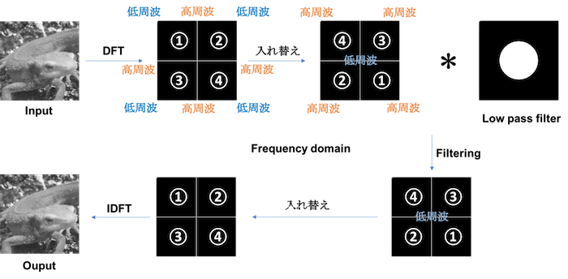

# 图像变换
[TOC]

## 傅立叶变换（Fourier Transform）

使用离散二维傅立叶变换（Discrete Fourier Transformation），将灰度化的`imori.jpg`表示为频谱图。然后用二维离散傅立叶逆变换将图像复原。

二维离散傅立叶变换是傅立叶变换在图像处理上的应用方法。通常傅立叶变换用于分离模拟信号或音频等连续一维信号的频率。但是，数字图像使用$[0,255]$范围内的离散值表示，并且图像使用$H\times W$的二维矩阵表示，所以在这里使用二维离散傅立叶变换。

二维离散傅立叶变换使用下式计算，其中$I$表示输入图像：
$$
G(k,l)=\frac{1}{H\  W}\ \sum\limits_{y=0}^{H-1}\ \sum\limits_{x=0}^{W-1}\ I(x,y)\ e^{-2\  \pi\  j\ (\frac{k\  x}{W}+\frac{l\  y}{H})}
$$
在这里让图像灰度化后，再进行离散二维傅立叶变换。

频谱图为了能表示复数$G$，所以图上所画长度为$G$的绝对值。这回的图像表示时，请将频谱图缩放至$[0,255]$范围。

二维离散傅立叶逆变换从频率分量$G$按照下式复原图像：
$$
I(x,y)=\frac{1}{H\  W}\ \sum\limits_{l=0}^{H-1}\ \sum\limits_{k=0}^{W-1}\ G(l,k)\ e^{2\  \pi\  j\ (\frac{k\  x}{W}+\frac{l\  y}{H})}
$$

上式中$\exp(j)$是个复数，实际编程的时候请务必使用下式中的绝对值形态[^1]：

[^1]: 这里应该有个公式的，但是它不知道去哪儿了。

如果只是简单地使用`for`语句的话，计算量达到$128^4$，十分耗时。如果善用`NumPy`的化，则可以减少计算量（答案中已经减少到$128^2$）。

## 傅立叶变换——低通滤波

将`imori.jpg`灰度化之后进行傅立叶变换并进行低通滤波，之后再用傅立叶逆变换复原吧！

通过离散傅立叶变换得到的频率在左上、右上、左下、右下等地方频率较低，在中心位置频率较高。

在图像中，高频成分指的是颜色改变的地方（噪声或者轮廓等），低频成分指的是颜色不怎么改变的部分（比如落日的渐变）。在这里，使用去除高频成分，保留低频成分的**低通滤波器**吧！

在这里，假设从低频的中心到高频的距离为$r$，我们保留$0.5\ r$​的低频分量。

## 傅立叶变换——高通滤波

将`imori.jpg`灰度化之后进行傅立叶变换并进行高通滤波，之后再用傅立叶逆变换复原吧！

在这里，我们使用可以去除低频部分，只保留高频部分的**高通滤波器**。假设从低频的中心到高频的距离为$r$，我们保留$0.2\ r$​的低频分量。

## 傅立叶变换——带通滤波

将`imori.jpg`灰度化之后进行傅立叶变换并进行带通滤波，之后再用傅立叶逆变换复原吧！

在这里，我们使用可以保留介于低频成分和高频成分之间的分量的**带通滤波器**。在这里，我们使用可以去除低频部分，只保留高频部分的高通滤波器。假设从低频的中心到高频的距离为$r$，我们保留$0.1\  r$至$0.5\  r$的分量。  

## PCA
PCA(Principal Component Analysis)，即主成分分析方法，是一种使用最广泛的数据降维算法。PCA的主要思想是将n维特征映射到k维上，这k维是全新的正交特征也被称为主成分，是在原有n维特征的基础上重新构造出来的k维特征。PCA的工作就是从原始的空间中顺序地找一组相互正交的坐标轴，新的坐标轴的选择与数据本身是密切相关的。其中，第一个新坐标轴选择是原始数据中方差最大的方向，第二个新坐标轴选取是与第一个坐标轴正交的平面中使得方差最大的，第三个轴是与第1,2个轴正交的平面中方差最大的。依次类推，可以得到n个这样的坐标轴。通过这种方式获得的新的坐标轴，我们发现，大部分方差都包含在前面k个坐标轴中，后面的坐标轴所含的方差几乎为0。于是，我们可以忽略余下的坐标轴，只保留前面k个含有绝大部分方差的坐标轴。事实上，这相当于只保留包含绝大部分方差的维度特征，而忽略包含方差几乎为0的特征维度，实现对数据特征的降维处理。
